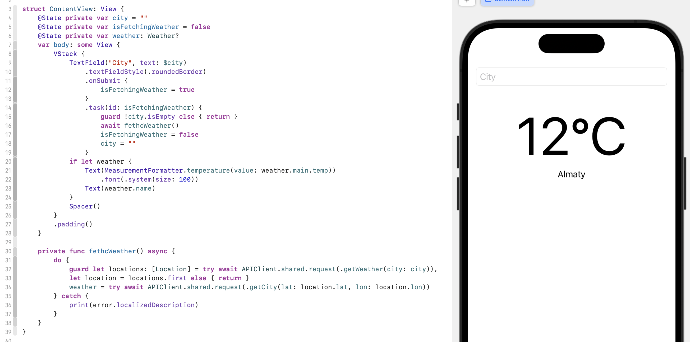

#  Weather


```
extension MeasurementFormatter {
    static func temperature(value: Double) -> String {

        let numberFormatter = NumberFormatter()
        numberFormatter.maximumFractionDigits = 0

        let formatter = MeasurementFormatter()
        formatter.numberFormatter = numberFormatter

        let temp = Measurement(value: value, unit: UnitTemperature.kelvin)

        return formatter.string(from: temp)
    }
}
```

```
final class APIClient {
    static let shared = APIClient()
    private init() {}

    func request<Response: Decodable>(_ route: APIRoute) async throws -> Response {
        guard let request = route.request else { throw APIError.failedRequest}
        let (data, _) = try await URLSession.shared.data(for: request)
        let decoder = JSONDecoder()
        decoder.keyDecodingStrategy = .convertFromSnakeCase
        guard let result = try? decoder.decode(Response.self, from: data)
        else { throw APIError.failedTogetData }
        return result
    }
}
```

```
enum APIRoute {
    case getCity(lat: Double, lon: Double)
    case getWeather(city: String)

    var baseUrl: String {
        switch self {
        case .getWeather: return "https://api.openweathermap.org/geo/1.0/direct"
        case .getCity: return "https://api.openweathermap.org/data/2.5/weather"
        }
    }

    var queryItems: [URLQueryItem] {
        switch self {
        case .getCity(let lat, let lon):
            return [
                URLQueryItem(name: "lat", value: "\(lat)"),
                URLQueryItem(name: "lon", value: "\(lon)"),
                URLQueryItem(name: "appid", value: apiKey)
            ]
        case .getWeather(let city):
            return [
                URLQueryItem(name: "q", value: city),
                URLQueryItem(name: "appid", value: apiKey)
            ]
        }
    }

    var apiKey: String {
        (Bundle.main.object(forInfoDictionaryKey: "APIKEY") as? String) ?? ""
    }

    var httpMethod: String { "GET" }

    var request: URLRequest? {
        guard let url = URL(string: baseUrl),
              var components = URLComponents(url: url, resolvingAgainstBaseURL: true) 
        else { return nil }
        components.queryItems = queryItems
        var request = URLRequest(url: components.url ?? url)
        request.httpMethod = httpMethod
        request.timeoutInterval = 10
        return request
    }
}

```
